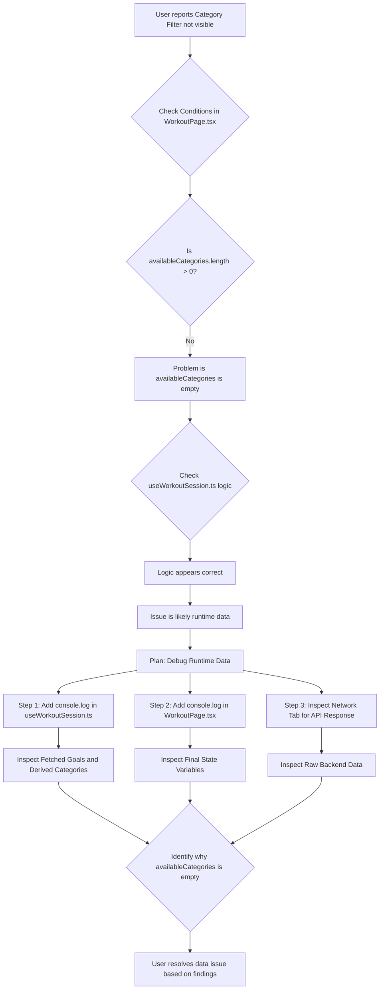

# Debugging the Category Filter Visibility

This document outlines the steps to debug why the category filter might not be visible in the Workout Execution page.

## Understanding the Visibility Condition

The category filter in `src/features/workoutExecution/components/WorkoutPage.tsx` is rendered only when **all three** of the following conditions are true:

1.  `selectedWorkoutMicrocycle !== null`: A microcycle has been successfully selected.
2.  `!isLoadingGoals`: The application has finished loading the active goals (exercises) for the selected microcycle.
3.  `availableCategories.length > 0`: At least one unique category has been found among the active goals for the selected microcycle.

If the category filter is not appearing, it means one or more of these conditions are false. Based on the code logic, the most probable cause is that `availableCategories.length` is `0`.

## Potential Causes for `availableCategories.length` being 0

The `availableCategories` state is populated in the `src/features/workoutExecution/hooks/useWorkoutSession.ts` hook using the `getUniqueCategoriesFromGoals` helper function. This function extracts categories from the `fetchedGoals` array returned by the `workoutService.fetchActiveGoalsForWorkout` service call.

`availableCategories.length` can be 0 if:

1.  The `fetchActiveGoalsForWorkout` service call returns an empty array (`[]`) of goals for the selected microcycle.
2.  The service call returns goals, but none of those goals have a `categories` property defined, or their `categories` arrays are empty (`[]`).

## Debugging Steps (Runtime Inspection)

To determine the exact reason why `availableCategories.length` is 0, you must inspect the data at runtime using your browser's developer tools (e.g., Chrome DevTools, Firefox Developer Tools).

Here are the recommended debugging steps:

1.  **Add Console Logs in `useWorkoutSession.ts`:**
    Insert `console.log` statements within the `useEffect` responsible for fetching goals (Effect 2) in `src/features/workoutExecution/hooks/useWorkoutSession.ts`. This will show you the raw `fetchedGoals` array and the `uniqueCategories` array derived from it.

    ```typescript
    // Inside useWorkoutSession.ts, within the useEffect for fetching goals (Effect 2)

    console.log('[useWorkoutSession] Fetching goals for microcycle:', selectedWorkoutMicrocycle);

    workoutService.fetchActiveGoalsForWorkout(user.id, selectedWorkoutMicrocycle)
      .then(fetchedGoals => {
        console.log('[useWorkoutSession] Fetched Goals:', fetchedGoals); // <-- IMPORTANT: INSPECT THIS ARRAY
        setAllActiveGoalsForMicrocycle(fetchedGoals);
        const uniqueCategories = getUniqueCategoriesFromGoals(fetchedGoals);
        console.log('[useWorkoutSession] Derived Available Categories:', uniqueCategories); // <-- IMPORTANT: INSPECT THIS ARRAY
        setAvailableCategories(uniqueCategories);
        setAvailableEquipment(getUniqueEquipmentFromGoals(fetchedGoals));
      })
      .catch(err => {
        console.error('[useWorkoutSession] Error fetching active goals:', err);
        setError('Failed to load active goals for the selected microcycle.');
        setAllActiveGoalsForMicrocycle([]);
        setAvailableCategories([]);
        setAvailableEquipment([]);
      })
      .finally(() => setIsLoadingGoals(false));
    ```

2.  **Add Console Logs in `WorkoutPage.tsx`:**
    Add logs directly within the `WorkoutPage` component in `src/features/workoutExecution/components/WorkoutPage.tsx` to confirm the final values of the state variables (`selectedWorkoutMicrocycle`, `isLoadingGoals`, `availableCategories`) just before the component renders.

    ```typescript
    const WorkoutPage: React.FC = () => {
      // ... existing destructuring from useWorkoutSession()

      console.log('--- WorkoutPage Category Filter Check ---');
      console.log('selectedWorkoutMicrocycle:', selectedWorkoutMicrocycle);
      console.log('isLoadingGoals:', isLoadingGoals);
      console.log('availableCategories:', availableCategories);
      console.log('availableCategories.length:', availableCategories.length);
      console.log('--- End WorkoutPage Category Filter Check ---');

      // ... rest of your component
    };
    ```

3.  **Inspect Network Requests:**
    Open your browser's developer tools, navigate to the "Network" tab, and observe the API call made by `fetchActiveGoalsForWorkout`. Examine the response payload to see the raw data structure and content being returned by your backend. This is critical to verify if the backend is sending the expected goal objects with populated `categories` arrays.

By carefully examining the console output and the network response, you should be able to identify whether the issue is that no goals are being returned, or if goals are returned but lack category information.

## Debugging Flow



Once you have performed these debugging steps and identified the root cause (e.g., backend not returning categories, data not structured correctly), you can then proceed to fix the data or the data processing logic.